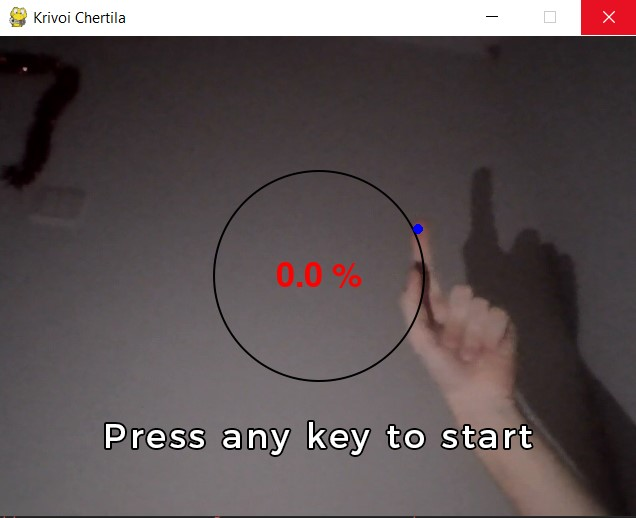
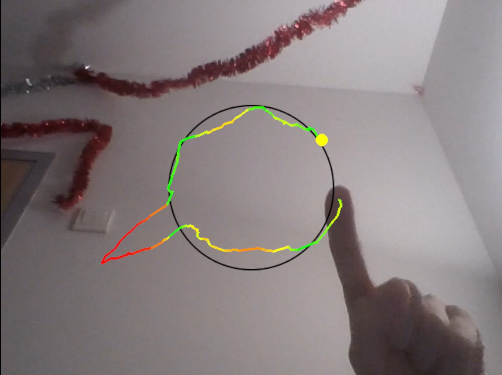
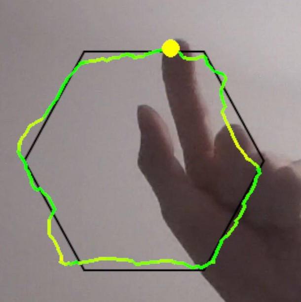
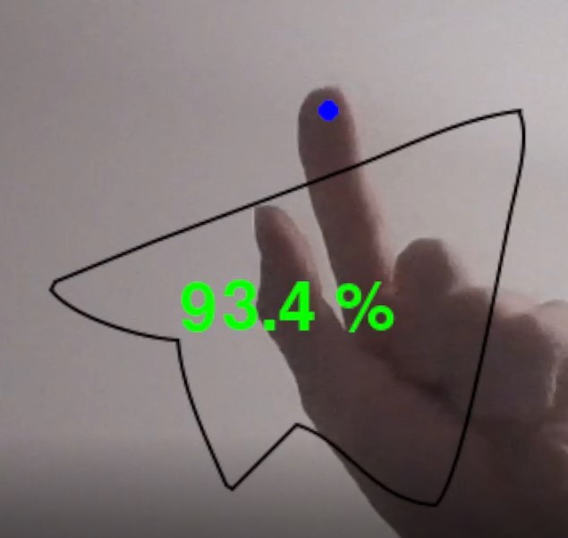
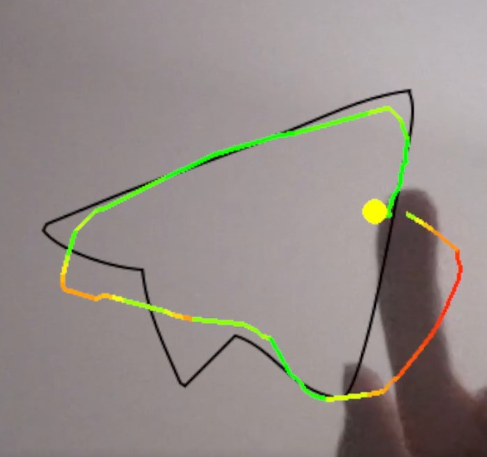
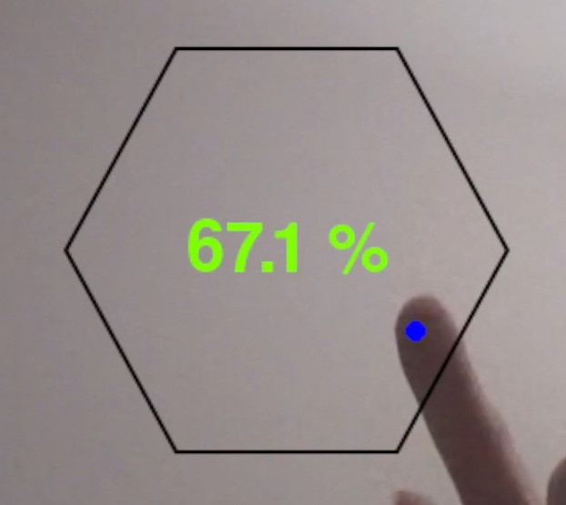
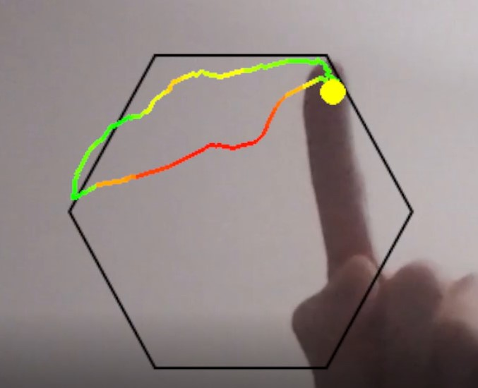
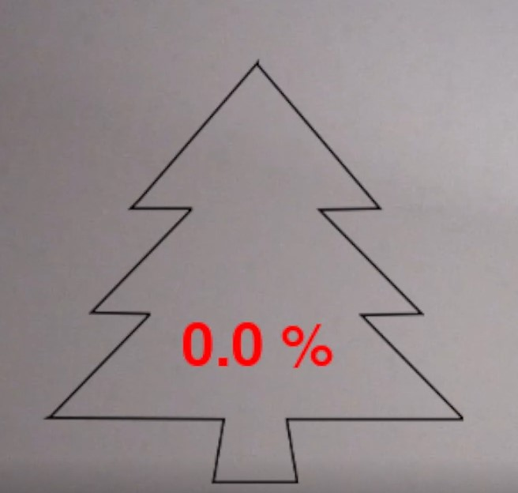
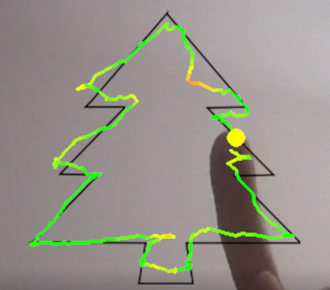
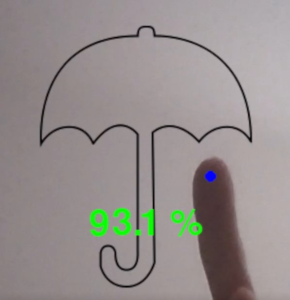

# Кривой Чертила

### Описание

"Кривой чертила" - игра, где надо обводить контур на экране за счёт рисования пальцем в воздухе.

### Установка

1. Скопировать все файлы проекта в проект в PyCharm. Для этого можно скачать .zip файл нажав "Code -> Download ZIP" и
   распаковать его в проекте.
2. Установить библиотеки:
   ```bash
   pip install -r requirements.txt
   ```

### Использование

1. Убедитесь, что камера на закрыта шторкой
2. Запустите файл main.py. Время запуска составляет около 20 секунд.
3. Появится окно с изображением веб-камеры. Убедитесь, что освещение подходящее (нужны белые тона) и программа
   отрисовывает кружок на указательном пальце правой руки:


**Примеры неправильного освещения**<br><br>


**Пример правильного освещения**
В кадре не должно быть две руки, иначе программа будет реагировать на обе:

4. Наведите палец на любую точку контура и нажмите на любую клавишу клавиатуры (например, на пробел), чтобы начать
   рисовать. Если при нажатии программа не обнаружила палец, то стартовой точкой будет первая точка, которую программа
   обнаружила.
5. Обведите контур. Чем ближе, тем выше будет результат. Близость можно понять по цвету контура - зелёный это близко,
   красный - очень далеко.



6. В конце покажется результат в процентах. Чем он ближе к 100%, тем лучше.
7. Теперь появился новый контур и игру можно начать сначала.
8. Для выхода из игры можно просто закрыть окно.

### Примеры с результатами


Пример 1

Результат 1

Пример 2

Результат 2

Пример 3

Результат 3

Пример 4

Результат 4
### Готовность проекта

Проект завершен. 

