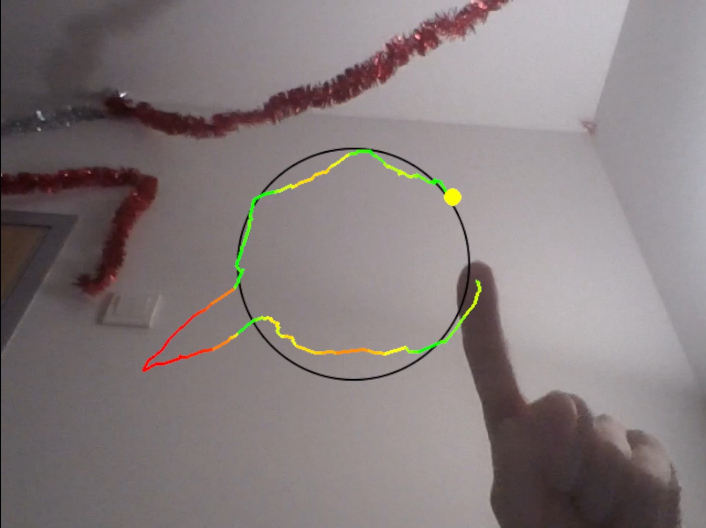
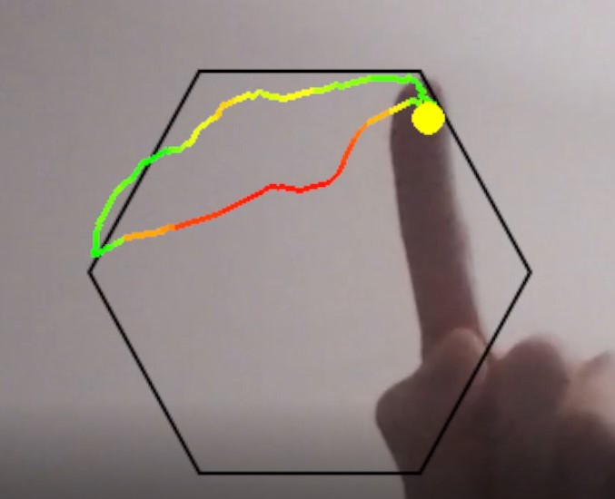

# Дневник проекта

## Введение ##

Так как дневник создавался уже после разработки, то здесь на основе коммитов в Git будут показаны ключевые этапы работы
и возникшие проблемы.

## Этапы ##

### 1. Вывод изображение на экран

Первым делом надо было понять, как я буду отрисовывать свою игру. Я остановился на PyGame, так как при работе с малым
количеством объектов. Необходимо было лишь понять, как выводить изображение с камеры. Я обнаружил вот такое решение:

> https://stackoverflow.com/questions/29673348/how-to-open-camera-with-pygame-in-windows

В итоге мы каждый кадр рисуем на экране текущее изображение.

### 2. Отслеживание пальца

Далее надо понять, как определять положение пальца. Велосипед изобретать не надо, в итоге я просто взял готовый код на
основе MediaPipe из Canvas:

Теперь если кончик распознан и уверенность высокая (выше 0.7), то мы отрисовываем кружочек:

**картинка с пальцем и кружком**

### 3. Рисование пути, неудачная версия

Первой попыткой было сохранять предыдущую позицию и текущую и рисовать между ними отрезок. Предполагалось, что старые
отрезки не будут исчезать, но это не так, ведь поверх них каждый кадр рисуется изображение с камеры.

Поэтому пришлось придумывать другое решение

### 4. Рисование пути, итоговая версия

Итоговым решением оказалось создать класс отрезка `Sector`, который хранит в себе начальное и конечное положение, свой
цвет и экран для отрисовки, и при вызове метода `update` отрисовывает себя на экране.

После каждого кадра в группу `Sectors` добавляется новый отрезок и к группе применяется метод `update`, за счёт чего
рисуются все отрезки:

### 5. Определение замкнутости пути

Для того, чтобы понять, замкнул ли пользователь круг, я решил сначала определить, что он отошел от начального положения
и потом вернулся. Теперь после нажатия любой клавиши начинает рисоваться контур, пока мы его не замкнем.

(см. )

### 6. Рисование картинки

Так как я изначально хотел добавить возможность использовать любой контур, то я решил в качестве контура для повторения
отрисовывать прозрачное изображение формата `.png` поверх камеры. Рисовал я контуры в Photoshop и самым первым стал
простой круг:

** вставить простую картинку **

### 7. Подсчёт результата (первая версия)

Теперь мы переходим к самой сложной части — как оценивать точность нарисованного контура.

Задача такова: у нас есть точки контура и точки нарисованного пути. Сразу приходит идея оценить расстояние от контура до
пути, т.е. для каждой точки контура найти расстояние до пути и посчитать среднее таких расстояний. Но сразу возникает
проблема: если пользователь обведёт контур, но ещё нарисует что-то поверх, то такой метод выдаст высокий результат:

**Пример пути, который выдаст высокий результат при первом способе.**

Тогда поступим наоборот: будем считать расстояние от каждой точки пути до контура. И тут проблема — пользователь может
обвести небольшую часть и получить высокий результат:

**Пример пути, который выдаст высокий результат при втором способе.**

Поэтому мы объединим оба подсчёта: если мы нарисуем точно, то оба средних дадут маленький результат, иначе одно из
средних точно выдаст плохой.

Далее надо перевести среднее расстояние в некоторый процент. Для этого воспользуемся функцией $`ae^{-kx}`$. Я далее
буду не раз пользоваться ей, так как она очень быстро устремляется в ноль при увеличении `x`, а при $`x = 0`$ выдает
значение `a`.

Поэтому, взяв функцию $`100e^{-0.015x}`$ мы можем выводить 100, если пользователь был достаточно близок и
это значение будет резко падать при больших неточностях.

### 8. Подсчёт результата (вторая версия)

> это значение будет резко падать при больших неточностях

— решил я. Оказалось, что такая система легко ломается при хаотичных движениях:

(см. `resources/tests/test_first_version.mp4`)

В последних видео видно

Поэтому надо сделать так, чтобы большие отклонения карались. Для этого я просто решил сделать большие отклонения более
значимыми в среднем, а это можно выполнить использовав функцию, которая очень быстро растёт. Таковой является $`e^{kx}`
$ — это одна из самых быстрорастущих функций. В итоге при больших неточностях получается плохой результат. Также вместо
того, чтобы объединять средние (см. предыдущий пункт), я взял наихудшее из них, так как если одно из них очень большое, то значит путь очень не точен.

См. `resources/tests/gameplay.mp4`

### 9. Покраска результата

Как можно было наблюдать в предыдущих пунктах, результат окрашивается в определенный цвет и чем хуже, тем он краснее. Я
пробовал много функций с разными коэффициентами, но в итоге остановился на отрезке косинуса, т.е.:

$`h = 30 - 30cos(s\pi/100)`$

где h - тон цвета, s - результат (от 0 до 100).
При близких к 100, значение тона около 60, т.е. зеленого цвета; далее при уменьшении происходит резкий спад и при
маленьких значениях получается красный цвет.

### 10. Покраска пути

Последнее, что осталось — покрасить сам путь. Чем он дальше, тем краснее. Здесь я также воспользовался $`ae^{-kx}`$,
т.к. мне надо, чтобы цвет становился красным при малейших отклонениях:

11. Рисование новых контуров для обводки

И последнее — нарисовать новые контуры. Я нарисовал 10 контуров и теперь они меняются друг за другом в случайном
порядке:

См. `resources/tests/gameplay.mp4`

Некоторые примеры контуров:

